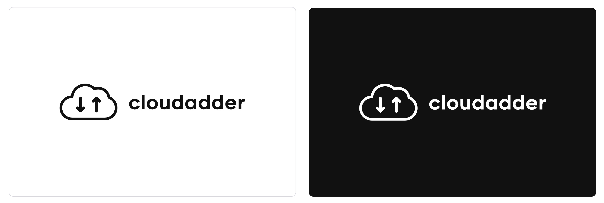

# @cloudadder/cloudadder-cdk-constructs

> A collection of higher-level reusable [cdk constructs](https://github.com/awslabs/aws-cdk)

## Constructs

This repository is a monorepo managed with [Projen](https://github.com/projen/projen). 
| Constructs                                                                                           | Description                                                                                                 | 
| ---------------------------------------------------------------------------------------------------- | ----------------------------------------------------------------------------------------------------------- | 

| [SampleBucket](https://github.com/cloudadder/cloudadder-cdk-constructs/blob/main/src/index.ts) | CDK Construct of an S3 Bucket    |
## Contributing

We welcome community contributions and pull requests.

